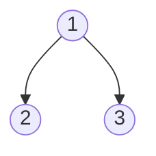

# [297. 二叉树的序列化与反序列化](https://leetcode-cn.com/problems/serialize-and-deserialize-binary-tree/)

```java
/**
 * Definition for a binary tree node.
 * public class TreeNode {
 *     int val;
 *     TreeNode left;
 *     TreeNode right;
 *     TreeNode(int x) { val = x; }
 * }
 */
public class Codec {
	public void serializeToList(List<Integer> list, TreeNode root) {
        if (root == null) list.add(null);
        else {
            list.add(root.val);
            serializeToList(list, root.left);
            serializeToList(list, root.right);
        }
    }

    // Encodes a tree to a single string.
    public String serialize(TreeNode root) {
        List<Integer> list = new ArrayList<>();
        serializeToList(list, root);
        return toString(list);
    }

    public TreeNode build(List<Integer> datas, int[] index) {
        Integer integer = datas.get(index[0]);
        index[0]++;
        if (integer == null) {
            return null;
        }
        TreeNode root = new TreeNode(integer);
        root.left = build(datas, index);
        root.right = build(datas, index);
        return root;
    }

    // Decodes your encoded data to tree.
    public TreeNode deserialize(String data) {
        List<Integer> list = toList(data);
        return build(list, new int[]{0});
    }

    private List<Integer> toList(String data) {
        List<Integer> list = new ArrayList<>();
        String[] datas = data.split(",");
        for(String item:datas){
            if(item.equals(""))continue;
            if(item.equals("null")){
                list.add(null);
            }else{
                list.add(Integer.parseInt(item));
            }
        }
        return list;
    }

    private String toString(List<Integer> list) {
        StringBuilder builder = new StringBuilder();
        for (Integer i : list) {
            if (i == null) {
                builder.append("null,");
            } else {
                builder.append(i).append(",");
            }
        }
        return builder.toString();
    }
}

// Your Codec object will be instantiated and called as such:
// Codec codec = new Codec();
// codec.deserialize(codec.serialize(root));
```

# 思路

使用前序遍历的方式序列化。使用List和int[]的作用是传递内存地址。

思路二：

```java
/**
 * Definition for a binary tree node.
 * public class TreeNode {
 *     int val;
 *     TreeNode left;
 *     TreeNode right;
 *     TreeNode(int x) { val = x; }
 * }
 */
public class Codec {
	// Encodes a tree to a single string.
    public String serialize(TreeNode root) {
        // 保证第一个结点非空
        if (root == null) return "";
        LinkedList<TreeNode> nodes = new LinkedList<>();
        nodes.add(root);
        StringBuilder builder = new StringBuilder();
        while (!nodes.isEmpty()) {
            LinkedList<TreeNode> children = new LinkedList<>();
            for (TreeNode node : nodes) {
                if (node == null) {
                    builder.append("null,");
                } else {
                    builder.append(node.val).append(",");
                    children.add(node.left);
                    children.add(node.right);
                }
            }
            nodes = children;
        }
        builder.deleteCharAt(builder.length() - 1);
        return builder.toString();
    }

    // Decodes your encoded data to tree.
    public TreeNode deserialize(String data) {
        if (data.length() <= 0) return null;
        String[] datas = data.split(",");
        TreeNode root = new TreeNode(Integer.parseInt(datas[0]));
        LinkedList<TreeNode> nodes = new LinkedList<>();
        nodes.add(root);
        int index = 1;
        while (!nodes.isEmpty()) {
            LinkedList<TreeNode> children = new LinkedList<>();
            for (TreeNode node : nodes) {
                if (datas[index].equals("null")) {
                    node.left = null;
                } else {
                    node.left = new TreeNode(Integer.parseInt(datas[index]));
                    children.add(node.left);
                }
                index++;
                if (datas[index].equals("null")) {
                    node.right = null;
                } else {
                    node.right = new TreeNode(Integer.parseInt(datas[index]));
                    children.add(node.right);
                }
                index++;
            }
            nodes = children;
        }
        return root;
    }
}

// Your Codec object will be instantiated and called as such:
// Codec codec = new Codec();
// codec.deserialize(codec.serialize(root));
```

# 思路

利用树的层序遍历。

注：



会被序列化成"1,2,3,null,null,null,null"